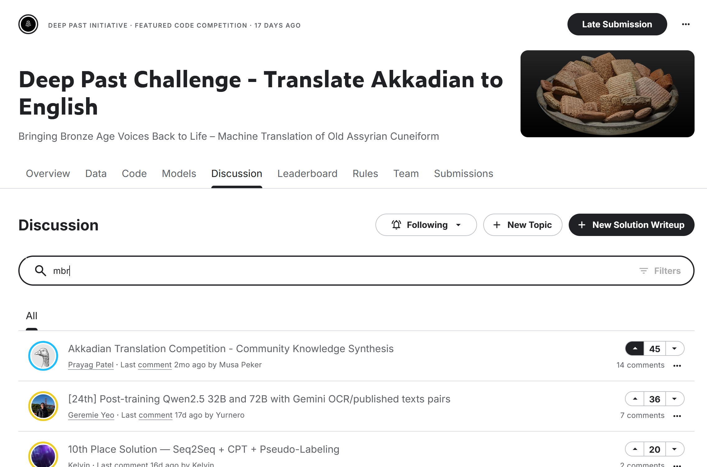

project 601 doesn't have a specific format requirement. but 600 thesis does.

but im doing 601

not required to print.

65 pages ish.
just kind of naturally lands around there.

30 pages might not be long enough.
150 is too much.

doing it in color can help
red means todo
blue is done

abstract is the last thing to write. chappy is good for that.

results and analysis are a later section because you won't have all 

background chapter/lit review are the easiest to get going.
// i might have to look up a bit more on akkadian

related work is a boring chapter, not super creative but easy to do.

usually intro is written later so it can match the paper.

if the depth of indentation for subsections is a lot then you can use 3.5.1.5 type notation.

3 levels is fine though 

generally anything I collected along the way is something fun to throw in.
eg. akkadian fun facts I saw or smth.

its still unclear if the thesis size will be large with just the outline. but my project definitely has enough material. but time is the biggest worry.

&&&& /
contact dr. kaur and ask if she'll be the second member of my commitee for thesis presentation
or chris

45 minute presentation

not a lot of time.

check around the middle of the quarter to see if its reasonable to finish this quarter or go to summer.

&&&&
add more to my outline
figure out what to put in
don't overthink it. just put it somewhere and can move it later. 
braindump.
don't worry much about making it look pretty for tappan, have him look first before making it pretty.

&&&&
one thing to check could be comparing any conflicts where team A used technique X and B used X and it was bad.
and where they agree.
Assess why their thing did/didn't work. 
write about this.
replicate it if I can.
think about why and discuss in thesis my thoughts.
making a chart of teams' "what worked and didn't work"
 use this
search for a technique in discussions, grab each leaderboard discussion that comes from that search result. and look at those.
don't read too much into stuff but just enough to have a plot for thesis. if theres not enough detail then eh.
just focus on top 10-15 compare and contrast. (only gold)

some submissions didn't provide data and that's fine, not much I can do about that.

theoretical: writing. thinking.
practical: coding. testing.
train it over the night and look at it in the morning. so I can test quickly

try getting a base model trained on the data and maybe fine tune it. or smth

3rd member will be non compsci, can do much later.

can fill out the form at any time for the member thing.
earlier get it in the queue, the better.