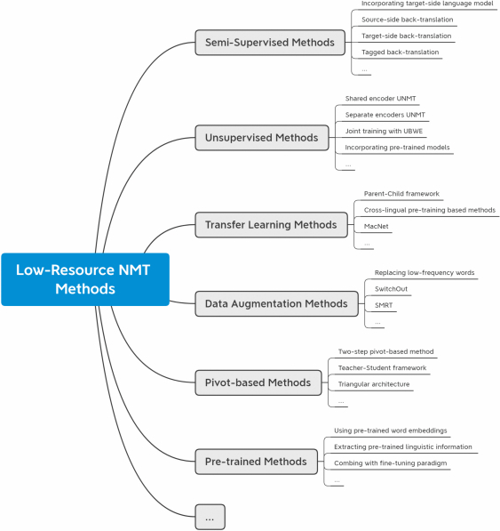
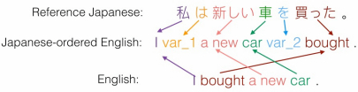

# Some techniques/tools/perspectives found from researching how others have done ML on dead languagess

✅ = Tried it, and it resulted in a score increase
❌ = Tried it, and it resulted in a score decrease (after fiddling and whatnot)
⬜ = Tried it, and it resulted in about the same score
📨 = Currently in progress

### From "Natural Language Processing with Transformers" book
- Fill Mask/ Masked Language Modelling pg. 290
- Data Augmentation: pg. 272
    - Back translation. of source text eg. En -> German -> En
    - Token Preturbations. (words or tokens?)
        - Synonym replacement
        - Random Insert
        - Random swap
        - Random Deletion
    - Unsupervised Data Augmentation (pipeline technique?) pg. 295
    - Uncertainty-aware self-training pg. 296
    - Link to https://amitness.com/posts/data-augmentation-for-nlp
### From ["A Visual Survey of Data Augmentation in NLP" ](https://amitness.com/posts/data-augmentation-for-nlp)
- Synonym replacement
    - Thesaurus
    - Word Embeddings
    - Masked language modelling from a pretrained model to predict similar words
    - low TF-IDF based word replacement. [(term frequency–inverse document frequency)](https://en.wikipedia.org/wiki/Tf%E2%80%93idf)
- Back Translation
- Random noise injection
    - Unigram Noising, Based on frequency distribution of a word
    - Blank noising, replacing words with "_" or some other thing.
    - Sentence Shuffling
    - Random Insert
    - Random Swap
    - Random Delete
- ⬜ Instance Crossover Augmentation, (swap pieces of different data phrases within same class) // We don't have classes. But a lot of these are similar in that they are basically emails.
    - *resulted in similar score but took longer to train*
- MixUp for Text 
    - //Used for classification but maybe it could probably be adapted to translation? 
    - word embeddings 
    - sentences
- Links are provided to libraries. and the book does this too.

### From [Low-resource Neural Machine Translation: Methods and Trends](https://dl.acm.org/doi/full/10.1145/3524300#sec-3)

- Backtranslation (section 3.1)
    - Use the original dataset to train the nn to do EN->Akkad. Then use a diff nn to create more Akkad<->EN Dummy data pairs from English data.
        - Then use this data to train a model. Apparently has proven effectiveness 
        - Apparently if you use the same model for both tasks it can have different effectiveness (unclear whats better?)
        - Or you can train two (one forward one backward) models at the same time to try to match each others output to agree with their translations
    - Apparently focusing on creating data with hard to predict words (I'm guessing these are the infrequent words) is helpful
    - Tagged Back Translation (3.1)
        - Backtranslation but you add tokens to distinguish the real data from the fake data for the model.
    - Apparently this method has trouble with distantly related languages. So perhaps it would be bad here? maybe if I did EN->Arabic first it could work. idk though.
- Denoising (3.2)
    - Have one encoder that encodes EN & Akkad, (align those vectors?) then have two different decoders for the target languages we want (akkad or english direction)
        - "adversarial training objective is also introduced to constrain the source and the target sentence latent representations to have the same distribution. "
- Unsupervised Bilingual Word Embedding (UBWE) (3.2)
    - /// I wonder if I could use some sort of autoencoder model with the akkad stuff. or if that would even be worth the time? how hard is it to do?
    - [Vecmap Technique](https://github.com/artetxem/vecmap) seems to be supported by related papers
        - Perhaps I can use this to jointly and accurately add data augmentation.

- Byte Pair Encoding (3.3)
- Replacing words with low frequency words (3.4)
    - prioritize ones which are low freq in the target vocabulary. (Maybe akkad here?)
- K-Fold cross validation while using models to generate data? 
    -"Nguyen et al. [77] introduce a strategy from the data diversification viewpoint. It uses multiple forward and backward models to diversify the training data and merge them with the original dataset to train the final NMT model. More concretely, they first train multiple models on both backward (target source) and forward (source target) directions, and then use these models to generate synthetic training data." (3.4)
- Simulated Multiple Reference Training (SMTR) (3.4)
- //Maybe I could use the encoder half of the model to encode english sentences, then retrain it to encode akkad to have the same vectors, so it'd be like an autoencoder?
- Reordering the sentence (3.7)
    
    - "Zhou et al. [115] propose a method that can reorder the target language sentences to match the order of source language sentences and use the language order as an additional training supervision signal."

